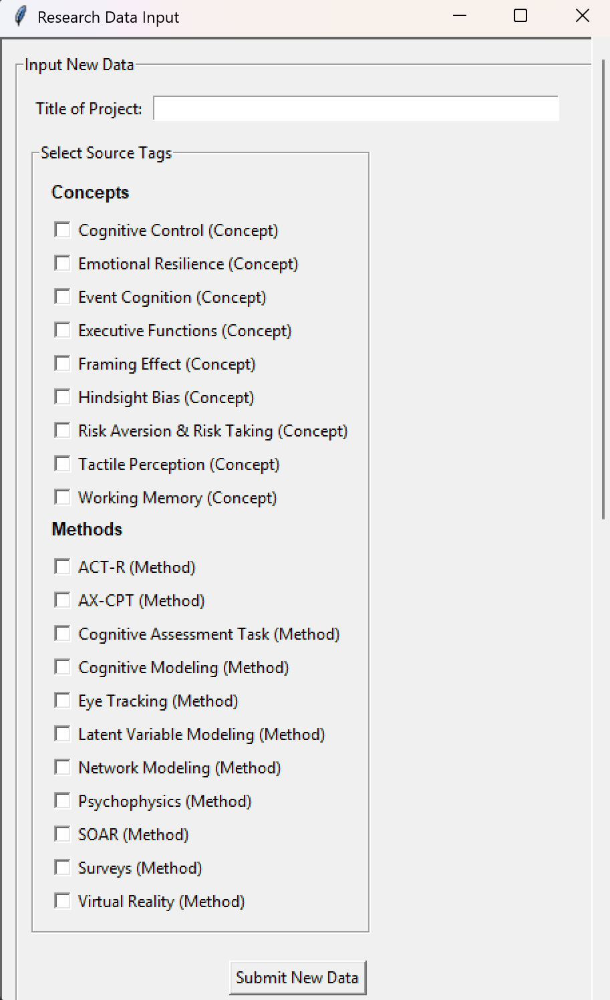
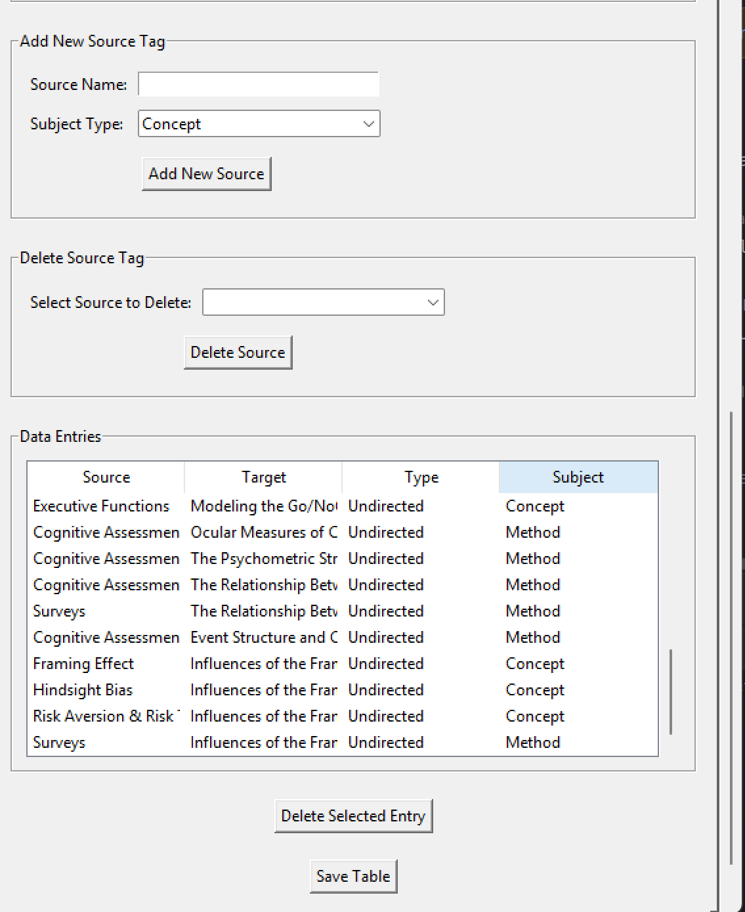
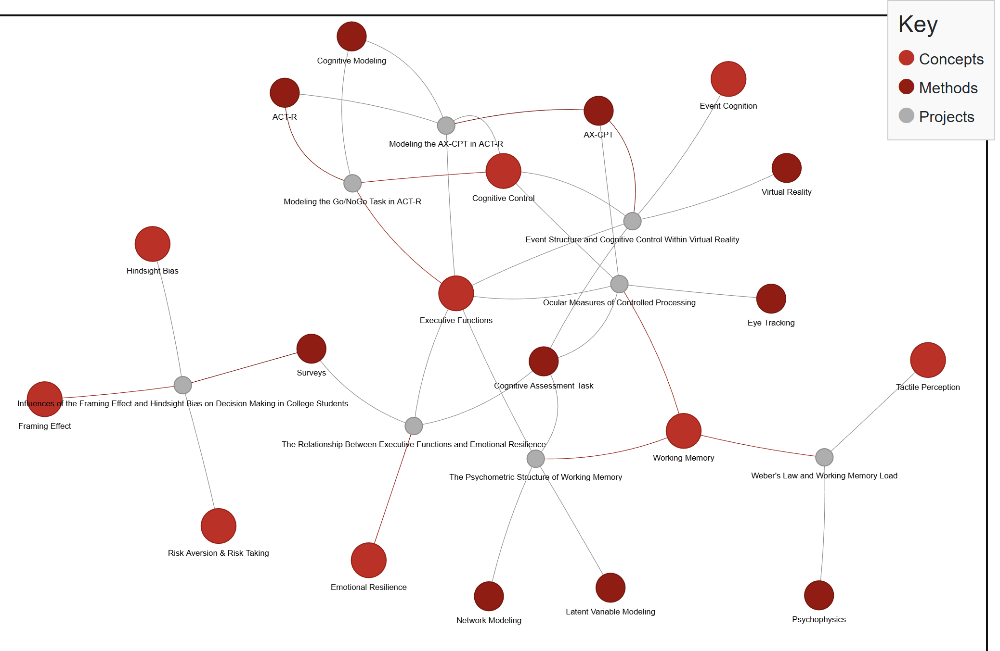

---

# Research Project Network Graph

This project provides a GUI-based data entry system for managing research project data and automatically generates an interactive network graph visualization from that data. The network graph is created using Pyvis and NetworkX, and the GUI is built with Tkinter.

---

## Features

### Data Entry GUI

- **Add New Data:**  
  Enter a project title and select one or more source tags. Each source tag is categorized as either a **Concept** or a **Method**, and a data entry is automatically generated and saved to a CSV file.
  
  

- **Manage Source Tags:**  
  Add or delete source tags. When deleting a tag that’s in use, the GUI warns you and lists the affected projects.
  
- **Data Entries Table:**  
  A scrollable, resizable table displays all CSV entries. You can delete individual data entries or refresh the table.

  

- **Save Table:**  
  Refreshes the table to ensure it reflects the latest data in the CSV file.

### Network Graph Visualization

- Generate an interactive graph from the CSV file by clicking the **"Display Graph"** button.
- Nodes are color-coded:
  - **Concepts:** Professional blue (#2980B9)
  - **Methods:** Polished orange (#F39C12)
  - **Projects:** Light grey (#BDC3C7)
- Custom physics settings allow smooth node dragging with reduced elasticity.
- A custom legend (key) is injected into the HTML output and displayed outside the graph area.



---

## Installation

### Prerequisites

- **Python 3.x**  
- **Required Libraries:**  
  - Tkinter (usually included with Python)  
  - pandas  
  - networkx  
  - pyvis

Install the required packages with pip:

```bash
pip install pandas networkx pyvis
```

---

## Usage

1. **Run the Data Entry GUI:**

   Execute the main GUI script (for example, `main_gui.py`):

   ```bash
   python main_gui.py
   ```

   This launches the data entry interface where you can add new research projects, manage source tags, view data entries, and save updates to the CSV file.

2. **Generate the Network Graph:**

   Once you have data saved in `ResearchTopicNetwork.csv`, click the **"Display Graph"** button in the GUI. This will launch the separate graph script (`graph.py`), which:
   
   - Reads the CSV data.
   - Generates an interactive HTML file (`research_topic_network.html`) with the network graph and an injected legend.
   - Opens the generated HTML file in your default web browser.

---

## Project Structure

- `main_gui.py` – The main Tkinter GUI script for data entry and CSV management.
- `graph.py` – The script for generating and displaying the interactive network graph using Pyvis.
- `ResearchTopicNetwork.csv` – The CSV file where data entries are saved (automatically generated/updated by the GUI).
- `sources.json` – The JSON file used for persisting source tag information (automatically generated/updated by the GUI).
- `README.md` – This documentation file.

---

## Customization

- **Physics Settings:**  
  Modify the Pyvis physics parameters in `graph.py` using the `set_options()` method to fine-tune node interactions (e.g., gravitational constant, spring length, damping, etc.).
- **Legend Customization:**  
  The legend (key) is injected into the generated HTML file. You can adjust its position, styling, and content by modifying the injected HTML in `graph.py`.

---

## Acknowledgments

- [Pyvis](https://pyvis.readthedocs.io/) for interactive network visualization.
- [Tkinter](https://docs.python.org/3/library/tkinter.html) for the GUI framework.
- [NetworkX](https://networkx.github.io/) for graph creation and manipulation.

--- 